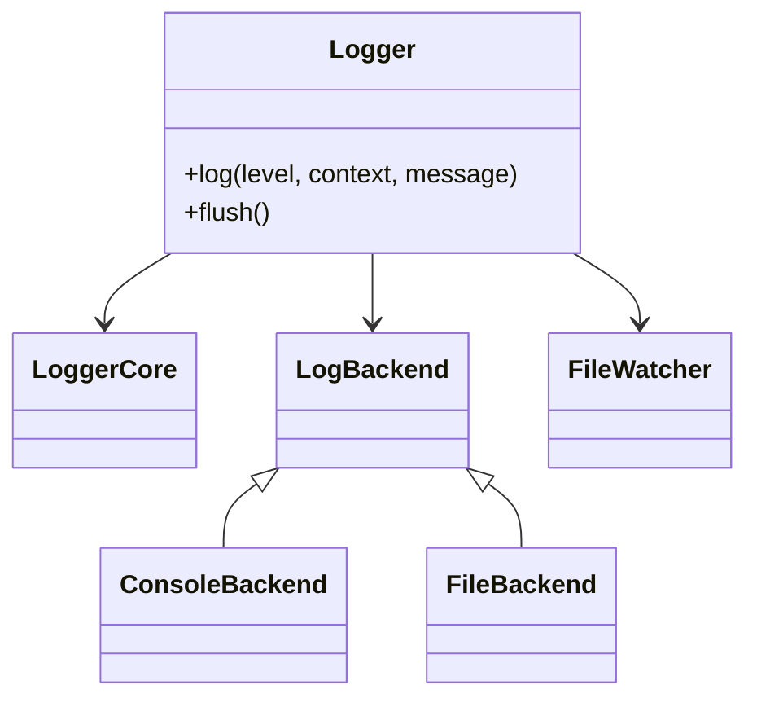
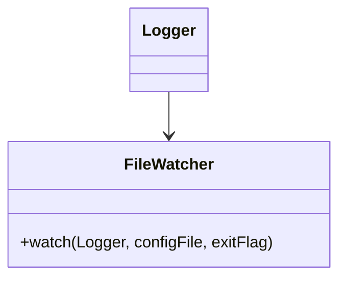

### **myLogger - High-Performance Asynchronous Logger for C++** 🚀

**myLogger** is a **modular, dependency-injection-based asynchronous logging system** designed for **high-performance applications**. It supports **multiple logging backends**, **hot-reloading configuration**, **log level filtering**, and **real-time file watching** with `inotify` on Linux.

---

## **📌 Features**

✔ **Asynchronous Logging** - Background thread processing for minimal overhead.  
✔ **Dependency Injection (DI) Design** - Easily plug-and-play different backends.  
✔ **Multiple Logging Backends** - Console, file logging, and future extensibility.  
✔ **Hot-Reloadable Configuration** - Updates `logger.conf` in real-time.  
✔ **Automatic Context Tracking** - Detects new contexts and updates logger.conf.
✔ **Log Level Filtering** - Supports configurable log severity levels.  
✔ **Thread-Safe** - Utilizes `std::mutex` and atomic variables for concurrency.  
✔ **Timestamped Log Entries** - Supports multiple timestamp formats.  
✔ **Real-Time File Watching** - Uses `inotify` (Linux) for detecting config changes.  
✔ **Minimal Setup** - Automatically generates `logger.conf` if missing.  
✔ **Batch Processing for Efficiency** - Reduces locking contention.  
✔ **Supports `const char*` and `std::string`** - No need for manual conversions.  
✔ **Google Benchmark Integration** - Built-in performance testing.

---

## **📚 Getting Started**

### **1️⃣ Installing myLogger**
To install `myLogger` system-wide:

```sh
mkdir -p cmake-build-release && cd cmake-build-release
cmake .. -DCMAKE_BUILD_TYPE=Release
make -j$(nproc)
sudo cmake --install . --prefix /usr/local
```

---

## **🔧 Integrating `myLogger` into Your Project**

### **1️⃣ CMake Configuration**
Since `toml++` is now an external dependency, you need to install it separately.

#### **Arch Linux (via pacman)**
```sh
sudo pacman -S tomlplusplus
```

#### **Debian/Ubuntu**
```sh
git clone https://github.com/marzer/tomlplusplus.git
cd tomlplusplus
sudo cp -r include/toml++ /usr/local/include/
```

#### **CMake Setup for Your Project**
```cmake
cmake_minimum_required(VERSION 3.16)
project(MyProject LANGUAGES CXX)

set(CMAKE_CXX_STANDARD 20)

# ✅ Find dependencies
find_package(tomlplusplus REQUIRED)
find_package(myLoggerLib REQUIRED)

# ✅ Link myLoggerLib
add_executable(MyApp main.cpp)
target_link_libraries(MyApp PRIVATE myLogger::myLoggerLib)
target_include_directories(MyApp PRIVATE ${myLoggerLib_INCLUDE_DIRS})
```

---

## **📝 Usage**

### **2️⃣ Setting Up Logger with Multiple Backends**
```cpp
#include "myLogger/my_logger.hpp"
#include "myLogger/backends/console_backend.hpp"
#include "myLogger/backends/file_backend.hpp"

int main() {
    auto settings = std::make_shared<LoggerSettings>();
    ConsoleBackend console;
    FileBackend file;
    
    Logger<ConsoleBackend, FileBackend> logger(settings, console, file);
    
    logger.log("INFO", "GENERAL", "Application started");
    return 0;
}
```

### **3️⃣ Log Levels and Contexts**
```cpp
logger.log("INFO", "GENERAL", "This is an info message");
logger.log("ERROR", "DATABASE", "Database connection failed");
```

### **4️⃣ Supports `std::string` and `const char*` Natively**
```cpp
logger.log("INFO", "OpenGL", "Using OpenGL version " + std::string(reinterpret_cast<const char*>(glGetString(GL_VERSION))));

const char* errorMsg = "Failed to load texture";
logger.log("ERROR", "Graphics", errorMsg);  // ✅ Works with `const char*`

std::string dynamicMessage = "Server response time: " + std::to_string(120) + "ms";
logger.log("DEBUG", "Network", dynamicMessage);  // ✅ Works with `std::string`
```

---

## **📌 Class Structure**

### **1️⃣ Logger System Overview**


### **2️⃣ File Watching & Hot Reloading**


---

## **📌 Next Steps**
✅ **[ ] Implement additional backends (network, database, etc.)**  
✅ **[ ] Improve log rotation & compression**  
✅ **[ ] Optimize memory usage for high-throughput logging**  
✅ **[ ] Extend logging with JSON output for structured logs**

---

👤 **Author**: @BoboBaggins  
📜 **License**: MIT
