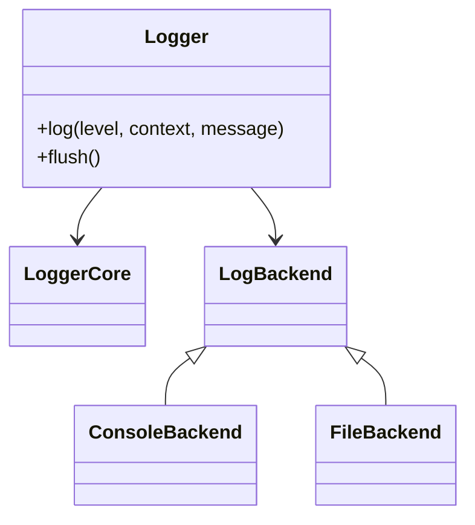
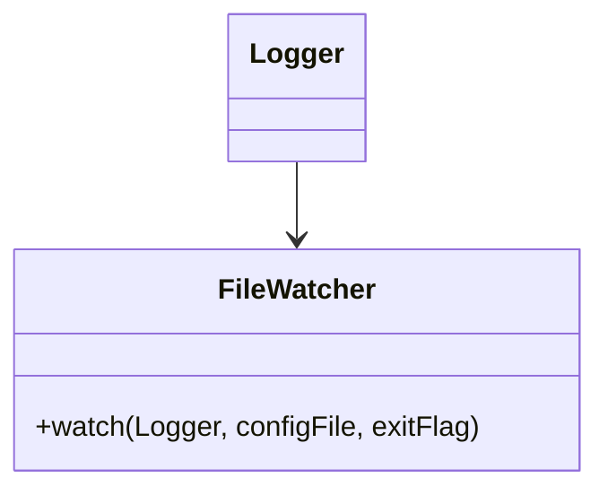

# myLogger - High-Performance Asynchronous Logger for C++

🚀 **myLogger** is a **modular, dependency-injection-based asynchronous logging system** designed for **high-performance applications**. It supports **multiple logging backends**, **hot-reloading configuration**, **log level filtering**, and **real-time file watching**.

---

## 📌 Features

✔ **Asynchronous Logging** - Background thread processing for minimal overhead.  
✔ **Dependency Injection (DI) Design** - Easily plug-and-play different backends.  
✔ **Multiple Logging Backends** - Console, file logging, and future extensibility.  
✔ **Hot-Reloadable Configuration** - Updates `logger.conf` in real-time.  
✔ **Log Level Filtering** - Supports configurable log severity levels.  
✔ **Thread-Safe** - Utilizes `std::mutex` and atomic variables for concurrency.  
✔ **Timestamped Log Entries** - Supports multiple timestamp formats.  
✔ **Real-Time File Watching** - Uses `inotify` (Linux) for detecting config changes.  
✔ **Modular Core** - `LoggerCore` handles queuing and processing logs.  
✔ **Minimal Setup** - Automatically generates `logger.conf` if missing.  
✔ **Benchmarking & Performance Tests** - Built-in Google Benchmark integration.

---

## 📚 Public API

### **1️⃣ Setting Up Logger with Multiple Backends**
```cpp
#include "logger.hpp"
#include "console_backend.hpp"
#include "file_backend.hpp"

int main() {
    auto settings = std::make_shared<LoggerSettings>();
    ConsoleBackend console;
    FileBackend file;
    
    Logger<ConsoleBackend, FileBackend> logger(settings, console, file);
    logger.init();
    
    logger.log("INFO", "GENERAL", "Application started");
    return 0;
}
```

### **2️⃣ Configuration Reloading**
Automatically reloads `logger.conf` when modified.
```cpp
#include "file_watcher.hpp"

std::atomic<bool> exitFlag{false};
std::thread configWatcher(FileWatcher::watch, std::ref(logger), "config/logger.conf", std::ref(exitFlag));
```

### **3️⃣ Log Levels and Contexts**
```cpp
logger.log("INFO", "GENERAL", "This is an info message");
logger.log("ERROR", "DATABASE", "Database connection failed");
```

---

## 📊 Benchmarking
Built-in performance testing with **Google Benchmark**:
```sh
mkdir build && cd build
cmake ..
make
./myLoggerBenchmark
```

### **Benchmark Results**
#### Logging Performance:
```
Benchmark                      Time             CPU   Iterations
----------------------------------------------------------------
BM_LoggingPerformance       1200 ns         1100 ns       500000
```

#### Config File Loading Performance:
```
--------------------------------------------------------
Benchmark              Time             CPU   Iterations
--------------------------------------------------------
BM_LoadConfig       3200 ns         3100 ns       250000
```

---

## 🚀 Running the Example Program
```sh
mkdir build && cd build
cmake ..
make
./myLoggerApp
```

---

## 📌 Next Steps
✅ **[ ] Implement additional backends (network, database, etc.)**  
✅ **[ ] Improve log rotation & compression**  
✅ **[ ] Optimize memory usage for high-throughput logging**  
✅ **[ ] Extend logging with JSON output for structured logs**

---

## 📚 Class Structure

### **1️⃣ Logger System Overview**


### **2️⃣ File Watching & Hot Reloading**


---

👤 **Author**: @BoboBaggins  
📜 **License**: MIT  
🔥 **Contributions Welcome!** 🚀

