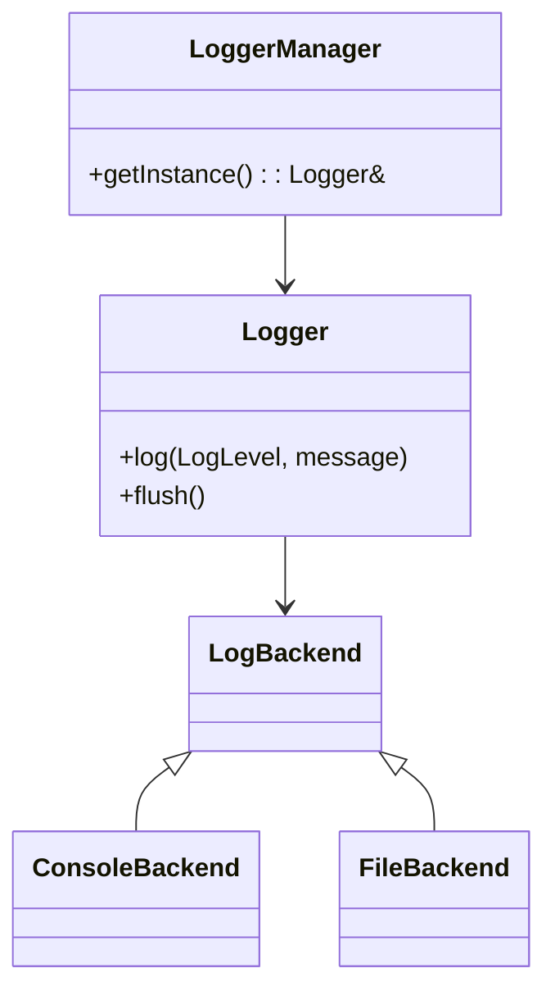
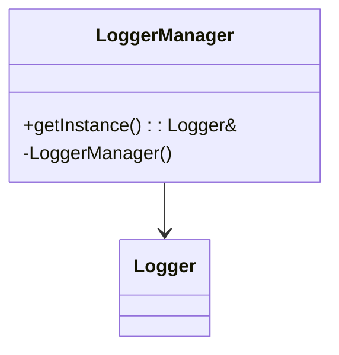
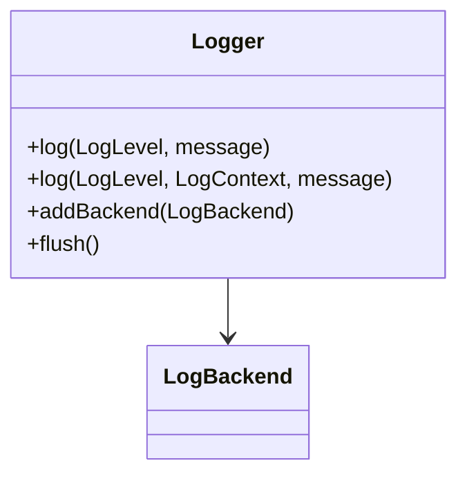
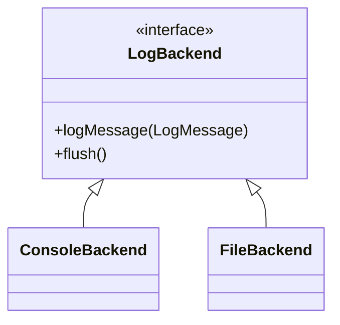
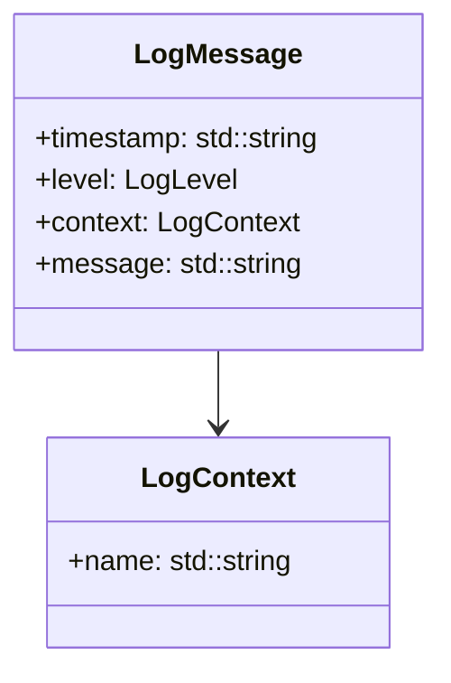

# myLogger - Asynchronous Multi-Backend Logger for C++

🚀 **myLogger** is a **high-performance, asynchronous logger** supporting **multiple backends (console, file)** with **log level filtering**, **automatic log rotation**, and **timestamped log entries**.

---

## 📌 Features

👉 **Automatic Configuration** - No manual setup needed, loads from `logger.conf` or creates a default one.  
👉 **Asynchronous Logging** - Logs run in a background thread.  
👉 **Multiple Backends** - Supports **Console + File Logging Simultaneously**.  
👉 **Log Level Filtering** - Set **INFO, WARN, ERROR, or DEBUG** log levels.  
👉 **Thread-Safe** - Uses **mutex and condition variables**.  
👉 **Timestamped Log Entries** - Every log message includes a precise timestamp.  
👉 **Timestamped Log Files** - Each session creates a new log file.  
👉 **Automatic Log Cleanup** - Removes logs older than a configurable threshold.  
👉 **LoggerManager for Simplified Setup** - Auto-configured on first use.  
👉 **Colored Console Output** - Logs appear in different colors based on **log level or context**.  
👉 **Benchmarking Support** - Performance tests for logging efficiency and config loading speed.  
👉 **Structured Log Messages** - Uses `LogMessage` struct for better log management.  
👉 **Easy Integration** - Single public include `#include "loggerLib.hpp"`.

---

## 📚 Public Interface
### 1⃣ Logger Usage (Automatic Configuration)
```cpp
#include "loggerManager.hpp"

int main() {
    Logger& logger = LoggerManager::getInstance();
    logger.log(LogLevel::INFO, "Application started");
    return 0;
}
```

#### 🛠 Methods
```cpp
void addBackend(std::unique_ptr<LogBackend> backend);
void setLogLevel(LogLevel level);
void log(LogLevel level, const std::string& message);
void log(LogLevel level, LogContext context, const std::string& message);
void flush();
```

---

### 2⃣ LoggerManager for Global Access
```cpp
#include "loggerManager.hpp"
Logger& logger = LoggerManager::getInstance();
logger.log(LogLevel::INFO, "Task started");
```

---

### 3⃣ Available Log Levels
```cpp
enum class LogLevel { INFO, WARN, ERROR, DEBUG };
```
👉 **INFO** → Logs everything, non-debug related.  
👉 **WARN** → Logs `WARN` and `ERROR`.  
👉 **ERROR** → Logs only `ERROR`.  
👉 **DEBUG** → Most detailed logs for debugging purposes.

---

## 📊 Benchmarking
Performance testing using **Google Benchmark**:
```sh
mkdir build && cd build
cmake ..
make
./myLoggerBenchmark
```

### Benchmark Results
#### Logging Performance:
```
Benchmark                      Time             CPU   Iterations
----------------------------------------------------------------
BM_LoggingPerformance       2252 ns         2175 ns       337001
```
👉 **Optimized for high-speed logging with minimal overhead.**

#### Config File Loading Performance:
```
--------------------------------------------------------
Benchmark              Time             CPU   Iterations
--------------------------------------------------------
BM_LoadConfig       3823 ns         3805 ns       182955
```
👉 **Efficient config file parsing and automatic loading.**

---

## 🚀 Running the Example Program
```sh
mkdir build && cd build
cmake ..
make
./myLoggerApp
```

---

## 📌 Next Steps
- ✅ **[ ] Custom context names**
- ✅ **[ ] Hot reload**
- ✅ **[ ] Improve Log Rotation (Compress Old Logs)**
- ✅ **[ ] Expand LoggerManager for More Configurations**
- ✅ **[ ] Further optimize logging throughput and reduce latency**

---

### **📚 Class Hierarchy**

<details>
<summary>🔹 **High-Level Overview** (Click to Expand)</summary>


</details>

---

<details>
<summary>🔹 **LoggerManager - Global Access & Configuration**</summary>



👉 **Singleton Pattern**: Ensures a single `LoggerManager` instance  
👉 **Auto Configuration**: Loads settings automatically  
👉 **Central Access**: Provides global logging access
</details>

---

<details>
<summary>🔹 **Logger - Core Logging System**</summary>



👉 **Asynchronous Logging**: Runs in a background thread  
👉 **Multiple Backends**: Supports **console + file logging**  
👉 **Structured Logging**: Uses `LogMessage` for log entries
</details>

---

<details>
<summary>🔹 **Log Backends - Console & File Logging**</summary>



👉 **Extensible Backend System**  
👉 **Supports Console & File Logging Simultaneously**  
👉 **Easily Add More Log Destinations** (e.g., database, network)
</details>

---

<details>
<summary>🔹 **Log Message & Context**</summary>



👉 **Encapsulated Log Entries**: Stores metadata (timestamp, level, context, message)  
👉 **Flexible Context Handling**: Enables categorization of logs
</details>

---

🤯 **Author**: @BoboBaggins  
👤 **License**: MIT

🔥 **Contributions Welcome!** 🚀